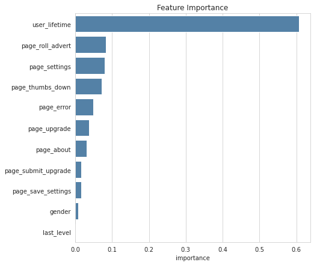

# Churn Prediction with PySpark

## Project Overview
Churn Prediction is a very common problem in nowadays business, and has been applied widely. 
In this project I’m about to build an end-to-end machine learning model to predict churn customer based on a sample dataset of Sparkify users data and the Apache Spark Machine Learning framework. 
The model is capable of predict which users is likely to churn the music application service.

The dataset contains logs of user interaction. Using the user logs, we need to identify customers with propensity to churn so they can be offered promotions. We can identify factors which are significant indicators for churn.
In Part I we only use a subset of data (~128MB) to train our churn prediction models locally to save cost. 
In PART II we will train our predictive model on a large dataset (~12GB) of customer’s activities on a cloud service to take full advantage of Spark’s distributed computing framework.

PySpark is used to clean, wrangle and process data and perform modeling and tuning to build a churn prediction model.

## Part I

This part will serve as an exploration of how to make a churn-prediction model using PySpark, with the following steps included:

1. Data loading
* Load subset from JSON
* Assess missing values

2. Exploratory Data Analysis (EDA)
* Define churn Cancellation Confirmation event 
* Transform data
* Overview of numerical and categorical columns
* Compare behavior of churn vs. non-churn users in terms of:
    * User interaction at different hours of the day
    * User interartion at different days of a week
    * User level (free vs. paid)
    * Event types (e.g. add a friend, thumbs up)
    
3. Engineer relevant features for our problem
* Create features on per user basis:
    * Latest user level
    * Time since registration
    * Gender of user
    * Time and number of session that user has engaged
    * Count and proportion of each event type
* Remove strongly correlated features
* Transform features to have distributions closer to normal

4. Modeling
* Split dataset into training and testing sets
* Train binary classifier models, and evaluate models performance (Metric: F1 Score)
* The classifiers presented in this project are as the following:
    * Logistic Regression
    * Decision Tree Classifier
    * Random Forest Classifier
 
5. Select and fine-tune the final model with K-fold Cross-Validation

### Results
* Model performance on testing set:

| classifier          | F1 score    |
| ------------------- | ----------- |
| Logistic Regression | 0.9167      |
| Decision Tree       | 0.8167      |
| Random Forest       | 0.9134      |

*The model performance could be further improved by tuning broader ranges of hyperparameters.

* Churns relate to users who have received more advertisements, disliked songs more often than liked, and registered more recently.

## Part II
The goal of this project is to create an end-to-end prediction model of churn user of the Sparkify music application; the tasks involved are the following:
* Preprocessing (load, clean, and transform) the raw dataset in json format with PySpark
* Analyze the data to define the set of features which can be used to train a predictive model
* Train classifiers that can determine of a user is churned or not by using Apache Spark Machine Learning framework
* Select the best and improve the model to get higher results
* Present the results in a Medium Blog Post (this post) of the end-to-end process to build an ML model in Apache Spark Machine Learning.

Analysis
Data Exploration

III. Methodology

The following steps have been applied to create an end-to-end model of Churn Prediction.
* Loading data (or Data Ingestion)
* Data Preprocessing (Data Cleaning and Transformation)
* Feature Engineering
* Training Model
* Tuning Model & Evaluation

Training Models
The following steps have been applied in Modeling phase.
Vectorize all the features
Standardize all input features
Split the dataset into train and test sets with the ratio of 0.8:0.2.
Train the model with different classifiers such as Random Forest, SVM and Gradient Boosted Trees.

Throughout this project, I have learnt and applied the different techniques of using Apache Spark in Data Engineering and Predictive Analytics. 

Even the model shows a pretty good results of F-1 score and accuracy, it still needs to be improved. For me, there are still some questions I need to clarify in order to improve and continue this project for an industrialized solution, such as:
